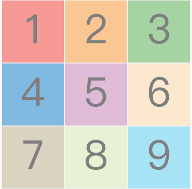

- 当鼠标离开临时框, header和footer隐藏
- 当用户框选了一个小于最小宽高的尺寸时, 临时框应该有应对政策. 比如适应变化去掉一些按钮, 或者规定最小的选框范围.
- 边缘resize
  - 2022-7-25 01:16:42 当鼠标移动到边缘修改鼠标样式 2022-7-25 01:46:16
  - 2022-7-25 01:46:20 当鼠标点下同时移动修改尺寸 2022-7-25 02:31:17
  - 2022-7-25 02:33:36 鼠标拖拽时禁止选中文字,防止干扰 2022-7-25 07:04:16
  - 2022-7-25 07:09:45 当拖动窗口时, 停止边缘resize 2022-7-25 07:20:37
- 添加按钮图标: > pine, save - x 2022-7-25 07:38:27 - 2022-7-25 15:11:18
- 去掉对body的遮罩 -立即完成
- 添加按钮 和 图标: 2022-7-25 16:17:40 - 2022-7-25 18:21:12
  - 图像处理
  - 滤镜
  - 图形标注
  - 文字标注
  - 手写标注
  - 放大
  - 缩小
  - 1:1
  - 手形
  - 链接
  - 标签
  - 工具箱(footer)
- shadowroot 2022-7-25 18:26:01 - 
  - 测试 shadow root 的 事件响应情况. 2022-7-25 19:27:16 -2022-7-26 08:46:27
- 重构代码 2022-7-26 08:46:36 - 2022-7-26 21:11:01 -2022-7-28 00:11:46
- 奇怪的地方, 代码没法触发连续事件响应, 找不到函数2022-7-28 00:11:56
- 设计新的shadowroot遮挡在我的插件与设备之间. 2022-7-29 08:20:57
- 监听高度变化, 并及时更新情况
- 聊聊布局
- 双击修改title
- 点击 > 隐藏到右侧
- 点击 pine钉在屏幕上
- 点击 - 收起body和footer
- 点击 x 关闭
- 当tempframe对象非空时, 启动框选会将其关闭
- 过渡动画
- 去掉拖动条, 直接整个header可拖动?不行
- bug: 当 选框实体存在过后 ctrl+alt+e 唤出框选模式, 但不框选, 点esc退出框选模式, 会导致持续存在 
- 好用颜色
- `#a6e3f5 #81bae0 #e7f1d3 #a5d3a2 #fbe8ce #fac792 #f79994 #dfbbd7 #d9d3bf`
- 

